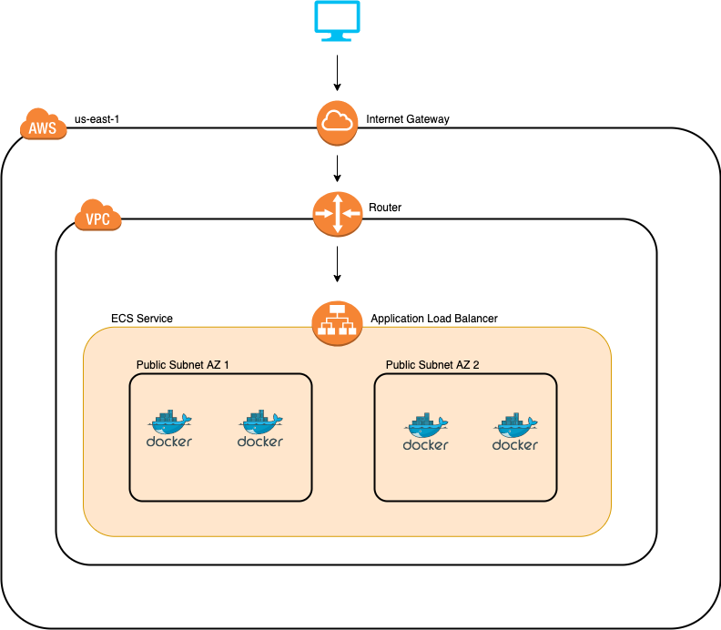

# Terraform ECS example

This example uses terraform to deploy ECS running fargate launch type.

Terraform will provision the following resources:

1. ECR repository
2. ECS cluster + service
3. ECS task definition
4. ECS Security group
5. VPC + 2 public subnets in 2 availability zones (us-east-1a & us-east-1b)
6. Internet gateway + Route table
7. ALB (Application Load Balancer)
8. ALB Security group
9. Elastic IP's (2)

## Continuous Deployment

This project also contains GitHub actions that push new Docker images to the ECR created within this repository.

Whenever the new image is pushed to ECR, we run an ECS service update like follows:

```bash
aws ecs update-service --cluster everlook-dev-node-ecs-public --service node-ecs --force-new-deployment
```

This uses the `deployment_minimum_healthy_percent` and `deployment_maximum_percent` within the ECS service definition to ensure there is no down time during ECS deployment.

## Architecture

